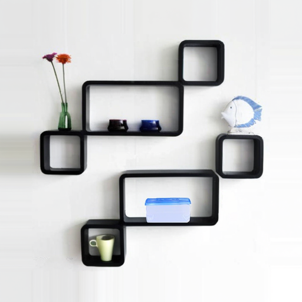
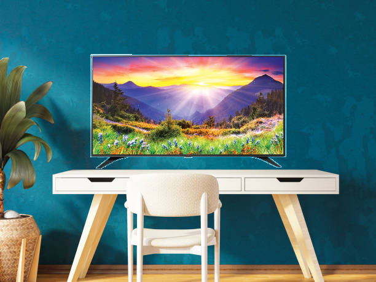

# Image Blending and Refinement

This project provides a tool for blending an overlay image onto a base image using a geometric approach, with an optional refinement step using the Stability AI API. It also includes a feature to compare the results of the geometric blending with the Stability AI refinement.

## Installation

1.  **Clone the repository:**
    ```bash
    git clone <repository-url>
    cd <repository-directory>
    ```

2.  **Create a virtual environment:**
    ```bash
    python3 -m venv .venv
    source .venv/bin/activate
    ```

3.  **Install the dependencies:**
    ```bash
    pip install -r requirements.txt
    ```

## How to Run

1.  **Set up the Stability AI API Key:**
    Create a `.env` file in the root of the project and add your Stability AI API key as follows:
    ```
    STABILITY_API_KEY=your-api-key
    ```

2.  **Run the script:**
    ```bash
    python3 main.py
    ```

3.  **Follow the prompts:**
    -   The script will first ask you to choose an example to run.
    -   Then, it will ask you to choose an approach:
        1.  **Logic (Geometric Blending) with Stability AI Refinement:** This will run the geometric blending and then refine the result using the Stability AI API. It will also generate a comparison image.
        2.  **Logic only (Geometric Blending):** This will only run the geometric blending.

## Examples

### Rack Container

<details>
<summary>Click to see Input and Output Images</summary>

| Input                                   | Output                                           |
| --------------------------------------- | ------------------------------------------------ |
| **Base Image**                          | **Logic Only**                                   |
|  |    |
| **Overlay Image**                       | **Stability Blended**                            |
|  |  |
|                                         | **Comparison**                                   |
|                                         |  |

</details>

### TV Wall

<details>
<summary>Click to see Input and Output Images</summary>

| Input                               | Output                                       |
| ----------------------------------- | -------------------------------------------- |
| **Base Image**                      | **Logic Only**                               |
|  |        |
| **Overlay Image**                   | **Stability Blended**                        |
|  |  |
|                                     | **Comparison**                               |
|                                     |  |

</details>
